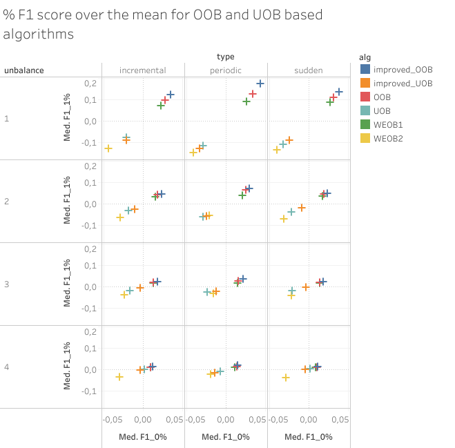

### Replication study on Stream Machine Learning algorithms for Class Imbalance and Concept Drift

**Table of Contents**

[TOCM]

# Introduction

Data Stream analysis is a rising field of Machine Learning where the data to be analyzed are coming from an infinite flow.
This is introducing new challenges regarding the use of a finite number of resourses and the need to be at least as fast as the this flow.
The difficulty on analyzind Data streams doesn't stop here. They usually have a very skewed class distribution known as **Class Imbalance**, and we need to be alert for **Concept Drifts**, indeed their distribution can change unpredictively over time.

# State of Art

I collected all the paper that i am referring to [here](papers/) 

# Dataset generation

I analyzed 3 types of drift with 4 imbalance rates for each Sea and Sine [datasets](datasets/SeaSine).
I generated 9 type with this data [genarator](datasets/Generator) each with 4 imbalance rates.
I also analyzed 3 real dataset you can find [here](datasets/Real). 

# Algorithms implementation

I implemented the algorithms in moa [here](algorithms code).
Here I uploaded only the corresponding java classes, for the complete moa fork refer to this [moa fork](https://github.com/08volt/moa "moa fork")).

# Experiments
I run 10 experiments for each Algorithm on each Dataset using an AWS virtual machine.
[Here](tests) you can find the code to build the bash to run the experiments and the code to build the query to extract the results from influx.

# Results

F1 score:

Recall:

Time and Memory:

