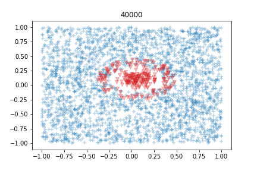
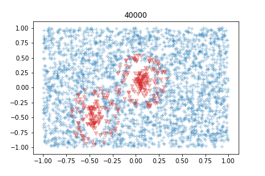
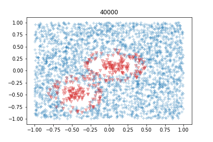
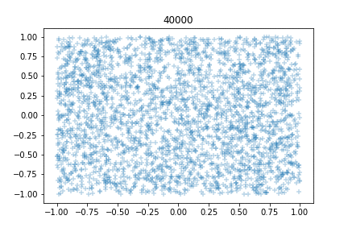
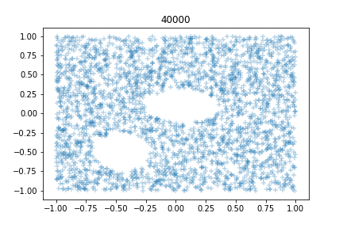
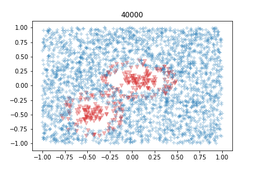
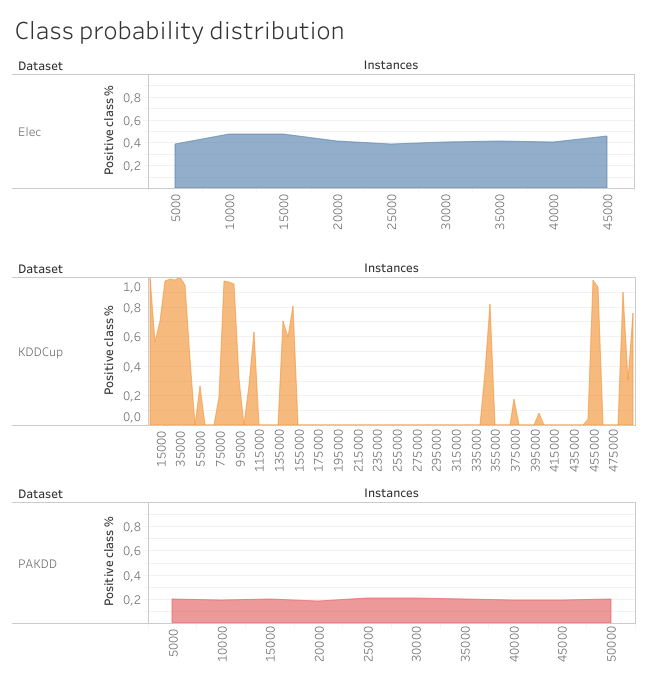
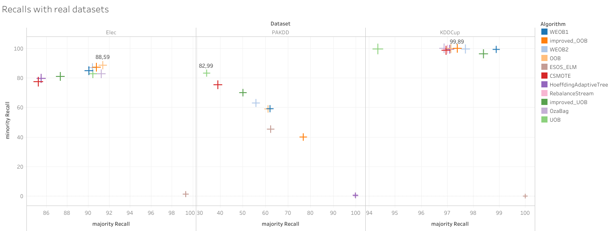

## Replication study on Streaming Machine Learning algorithms for Class Imbalance and Concept Drift

# Introduction

Data Stream analysis is a rising field of Machine Learning where the data to be analyzed are coming from an infinite flow.
This is introducing new challenges regarding the use of a finite number of resourses and the need to be at least as fast as the this flow.
The difficulty on analyzind Data streams doesn't stop here. They usually have a very skewed class distribution known as **Class Imbalance**, and we need to be alert for **Concept Drifts**, indeed their distribution can change unpredictively over time. I studied how solving the class imbalance problem affect the performances during the various types of concept drifts.

# Concept Drift

The data streams have a temporal nature and  therefore their characteristics and distribution can change over time, therefore algorithms that seek to learn from data streams must be able to accurately model the underlying distribution but also to detect and adapt to changes as fast as possible.
This characteristic of data stream is referred to as concept drift. The drift can occur with different speeds, sizes and severities and can change the model until previous samples become irrelevant.

Bayes' theorem dissect *P(X,y)* into different term, each one can be a cause of change. The theorem is stated mathematically as the following equation: 

*P(y|X) = ( P(X|y)P(y) ) / P(X)*

Each one of the four probability can change:

- *Pt(X) ~= Pt+1(X)* In this case it is possible to see changes in the overall distribution of data and it could also mean that the decision boundary is shifting. Being a change in *P(X)* independent from the class labels, it is insufficient to define a concept drift.
- *Pt(X|y) ~= Pt+1(X|y)* In this case the probability of seeing a data example *X* is changing but its label *y* isn't. It shows that we are seeing new example from the same environment and the drift does not affect the decision boundary. This particular drift is known as *virtual concept drift*. 
- *Pt(y|X) ~= Pt+1(y|X)* In this case the probability of a data example *X* of being of a particular class *y* is changing. This drift will cause the decision boundary to shift, and, as a consequence, it will lead algorithm's performances to deteriorate. This type of drift is known as *real concept drift*.
- *Pt(y) ~= Pt+1(y)* In this case the probability of seeing any data example from a particular class y is changing. This will cause the class ratio to change and possibly the switch between minority and majority class. It doesn't necessary shift the decision boundary but it can affect the performances of the algorithms anyway due to a change in the class imbalance status.

# State of Art

The algorithms I have tested are Online Bagging techniques, CSMOTE, Rebalance Stream and Ensamble of Online sequential extreme learning machine. 

## Online Bagging

The idea of this class of algorithms is to make an ensamble of base learners where for each one of them the classes are balanced, choosing how many times the learners will train with a new arriving sample based its class. This methods continuosly learn the class imbalance status in data streams and the sampling parameters for the learners adaptively.

### OOB and UOB
The class balancing can be done in two ways: Undesampling the majority class examples or Oversampling the minority class examples. 
In the original Oversampling Online Bagging and Undersampling Online Bagging there is a parameter "w(k)" for each class that denote the size percentage of class k and a parameter "R(k)" that denotes the accuracy of the model on class k and it can help the online learner to decide which class needs more attention.

OOB will update each learner 1 time if the sample is from a majority class, otherwise the number of updates will be choose from a Poisson distribution with lambda 1/w(k).

UOB will update each learner 1 time if the sample is from a minority class, otherwise the number of updates will be choose from a Poisson distribution with lambda 1 - w(k)    

### Improved OOB and UOB

This algorithms come from a more recente study of OOB and UOB claming that the strategy of setting lambda is not consistent with the imbalance degree, and varies with the number of classes.  
In this version of Online Bagging lambda is determined by the size ratio between classes. Considering the positive class (+) the minority and the negative class (-) the majority, improved OOB will set lambda(+) = w(-)/w(+) and lambda(-) = 1, improved UOB instead will set lambda(+) = 1 and lambda(-) = w(+)/w(-)  

### Weighted Ensambles

The same paper which proposed the improved versions also presented two ensamble strategies to combine the strength of OOB and UOB.
This ensambles need a new parameter, called Smoothed Recall. It is a moving avarage of the recall of each class to smooth out it's short-term fluctuations.
In order to weight the predictions of the OOB and UOB their G-mean values are computed using their Smoothed Recalls.
WEOB1 use the normalized G-mean values of OOB and UOB as their weights to compute a weighted sum of their predictions, WEOB2 instead compares the G-mean values and use only the prediction of the model with the higher one.  

## CSMOTE
Synthetic Minority Oversampling Technique (SMOTE) is one of the most used oversampling technique to solve the imbalance problem. It consinst on generating synthetic samples from a linear interpolation between a minority class sample and one of his neighbour selected randomly from his k-nearest neighbours.  

CSMOTE is an Online version of SMOTE that keeps the minority samples in a window managed by ADWIN. ADaptive sliding WINdow (ADWIN) is a chenge detector and estimation algorithm based on the exponantial histogram. It keeps a variable lenght window consistent with the hypothesis "there has been no change in the avarage value inside the window" by checking chenge at many scales simultaneously.  

When the minority sample ratio is less than a certain threshold, SMOTE is applied until the minority sample ratio is greater or equal than the threshold. The model is then trained with the new samples generated.  

## RebalanceStream

RebelanceStream aims at dealing with both concpet drift and class imbalance using ADWIN and multiple models. 
When new samples arrives, they are added to a batch and one base learner is trained.  

ADWIN deals with conpet drifts detecting a warning with a first threshold and than confirming it if the change is bigger than a second threshold.
At the warning detection, the algorithm start collecting samples in a new batch called resetBatch. When the ADWIN confirm the change 3 new learners are trained, one only with the resetBatch, one with the resetBatch balanced with SMOTE and one with the original Batch rebalanced with SMOTE. The one with the better k-statistic is chosen to be the new learner and both the Batch and the resetBatch are emptied.  

## Hoeffding Adaptive Tree
All the above algorithms have been tested with an ensamble of 10 Hoeffding Adaptive Tree (HAT) as base learners.  
The Hoeffding Tree is a tree based streaming classification algorithm that use the Hoeffding bound to decide if a leaf need to be splitted.  
The Adaptive version (HAT) uses an ADWIN to detect change and start building new trees. As soon as there is evidence that the new tree is more accurate, the old tree is replaced.  

## ESOS-ELM

Extreme learning machine (ELM) provides a single step least square estimatation method for training single hidden layer feed forward network. The input weights and biases connecting input layer to the hidden layer (hidden node parameters) are assigned randomly and the weights connecting the hidden layer and the output layer (output weights) are determined analytically. Compared to the traditional iterative gradient decent methods such as back propagation algorithm, training is extremely fast in ELM and it just requires a matrix inversion.  

The online version of this algorithm is called OS-ELM and it updates the ELM with data chunks. Recently, weighted extreme learning machine (WELM) has been proposed as a cost-sensitive algorithm for class imbalance learning and the corresponding online version WOS-ELM. However, WOS-ELM was proposed only for sta- tionary environments and may not be appropriate for concept drift learning.   

Ensemble of Subset Online Sequential Extreme Learning Machine (ESOS-ELM), has been proposed for class imbalance learning from a concept-drifting data stream. In ESOS-ELM, a minority class sample is processed by ‘m’ OS-ELM classifiers (‘m’ should be at least the imbalance ratio, in our case is 10) while a majority class sample is processed by a single classifier. The majority class samples are processed in a round robin fashion, i.e., the first majority class sample is processed by the first classifier, the second sample by the second classifier and so on. In this way, classifiers in the ensemble are trained with balanced subsets from the original imbalanced dataset. Furthermore the WELM is used as a batch classifier for recurrent concepts.    

I collected all the paper that i am referring to [here](papers/)   

# Datastreams

I generated 9 different types of drift forking this [generator](https://github.com/dabrze/imbalanced-stream-generator) and building a script to aumatically generate the data streams files. You can find my version of the generator and the script [here](datasets/Generator) 
Datastreams specifics:  
* 100 thousands examples each
* 4 imbalance rates: 1-9 / 2-8 / 3-7 / 4-6
* 3 different drift speeds: sudden at 50000th sample, incremental starting at 45000th sample and ending at 55000th sample, recurrent starting at 45000th sample, going until the 50000th and coming back at the original distribution at the 55000th sample.
* 9 drifts:

| Name                             |Drift type | Drift phase                                                              |
| :------------------------------: | :-------: | :----------------------------------------------------------------------: |
| appearing-clusters               | P(y\|X)    |                |
| splitting-clusters               | P(y\|X)    |                |
| shapeshift                       | P(y\|X)    |                        |
| clusters-movement                | P(y\|X)    |                 |
| disappearing-minority            | P(y)      |             |
| appearing-minority               | P(y)      |                |
| minority-share                   | P(y)      |                    |
| jitter                           | P(y|X)    |                            |
| borderline                       | P(y|X)    |                        |

I also tested the algorithms on the Sea and Sine [datasets](datasets/SeaSine) generated with the corresponding moa generators.   
SINE has two relevant attributes. Each attributes has values uniformly distributed in [0; 1]. In the first context all points below the curve y = sin(x) are classified as positive.  
SEA concepts functions are described in the paper "A streaming ensemble algorithm (SEA) for large-scale classification".  

Each one in the following versions:
* 2 types of drift: sudden, incremental
* 4 imbalance rates: 1-9 / 2-8 / 3-7 / 4-6

 - *p(y) Concept Drift*: Data streams SINE have a severe class imbalance change, in which the minority (majority) class of the first half of the data streams becomes the majority (minority) during the latter half. SEA have a less severe change, in which the data streams are balanced during the first half and become imbalanced during the latter half. In the gradual drifting cases, *p(y)* is changed linearly during the concept transition period (time step $45,000$ to time step $55,000$).
- *p(X|y) Concept Drift*: The data stream is constantly imbalanced. In particular, the class imbalance ratio, respectively in each stream, is 1:9, 2:8, 3:7 and 4:6 both before and after the concept drift occurrence. The concept drift in each data stream is determined by introducing a constraint that changes the *x1* probability of the negative class (*0*) of being less than a certain value *n*. Before the drift occurrence, the probability is *p(x1 < n) = 0.9* while after, it is *p(x1 < n) = 0.1*. In the gradual drifting cases, it is changed linearly during the concept transition period.
- *p(y|X)$ Concept Drift*: The data stream is constantly imbalanced. In particular, the class imbalance ratio, respectively in each stream, is 1:9, 2:8, 3:7 and 4:6 both before and after the concept drift occurrence. The data distribution in SINE involves a concept swap, while the data distribution in SEA has a concept drift due to the theta value change. The change in SEA is less severe than the change in SINE because some of the examples from the old concept are still valid under the new concept after the threshold moves completely.

I analyzed 3 real imbalanced datasets: Elec, PAKDD, KDDCup:  

Elec comes from Electricity and it is another widely used dataset described by M. Harries and analysed by Gama. This data was collected from the Australian New South Wales Electricity Market. In this market, prices are not fixed and are affected by demand and supply of the market. They are set every five minutes. The class label identifies the change of the price relative to a moving average of the last 24 hours.     
Instances: 45312  
Negative class %: 57%  
Positive class %: 42%  

The 13th Pacific-Asia Knowledge Discovery and Data Mining conference (PAKDD 2009) presented a competition focused on the problem of credit risk assessment.
The models needs to be robust against performance degradation caused by gradual market changes along a few years of business operation.   
Instances: 50000  
Negative class %: 80%  
Positive class %: 20%  

KDDCup 1999 is the data set used for The Third International Knowledge Discovery and Data Mining Tools Competition, which was held in conjunction with KDD-99 The Fifth International Conference on Knowledge Discovery and Data Mining. The competition task was classifier able to distinguish an intrusions from a normal connections. This database contains a standard set of data to be audited, which includes a wide variety of intrusions simulated in a military network environment.  
Instances: 494021  
Negative class %: 80%  
Positive class %: 20%  

you can find them [here](datasets/Real).   

# Algorithms implementation

The moa algorithms implementation can be found [here](algorithms_java).  
In this repository I uploaded only the corresponding java classes, for the complete version of moa refer to this [moa fork](https://github.com/08volt/moa "moa fork")).

# Experiments

I build a Benchmarking environment in order to automate the process of running the experiments and collecting the results. It is written in python and each step is done sequentially without needing any manual operation. Various configurations can be set just by updating the variables in a *Config* file, it is possible to set different algorithms, drifts and imbalance ratios. The benchmarking can be found [here](complete_exp_script/). It is composed by the following phases:
- **Data streams generation**: The experiments starts with the generation of the data streams. I saved into file \textit{.arff} the data streams in order for their generation not to affect the time and memory statistic of the algorithms. A bash file will be created and executed in order to interface with the the MOA cli and run the tasks.
- **Docker setup**: The experiments are run inside a docker container in order to measure their memory requirements with influx. A docker image need to be configured with the description of the library and software needed. It's composed by a *Dockerfile* containing the java version and the relative path to the working directory, and by a *Dockerfile.yml* describing the services and their configuration, in my case influx.
- **Experiment execution**:During this phase a bash file is created. It will run the tests sequentially, each in a different docker container. The results of each experiment is saved in a different csv file which will contain all the output statistics from MOA. 
- **Result summary**: During this phase a file for each of the statistics selected in the *Config* file is created. These files contains the results of all the experiments at each evaluation step. In the experiments an evaluation have been performed every *5000* instances. With these summaries a visualization and comparison of the performances will be straightforward. 

# Results on Artificial Datastreams

## P(X|y) drifts*:

P(X|y) drifts makes the examples probability distribution on the instance space change the decision boundary doesn’t shift. The artificial data streams with this kind of drift are:
- SEA P(X|y)
- SINE P(X|y)

## P(X|y) drifts*:

P(X|y) drifts makes the examples probability distribution on the instance space change the decision boundary doesn’t shift. The artificial data streams with this kind of drift are:
- SEA P(X|y)
- SINE P(X|y)

## P(X|y) drifts*:

P(X|y) drifts makes the examples probability distribution on the instance space change the decision boundary doesn’t shift. The artificial data streams with this kind of drift are:
- SEA P(X|y)
- SINE P(X|y)

## Time and Memory:

When evaluating algorithms it is important to keep track of the resources they need. All the Online Bagging based algorithms are much more fast and they need less memory. ESOS-ELM is the only one that isn't based on HAT which will condition the resource evaluation.
The last graph compares only the Online Bagging based algorithms. The ones with better Fscore are the one that occupy more resources.

# Results on Real Datasets

The reals datasets differ from the artificial ones in the number of feature which are more and in the use of categorical feautures. 

